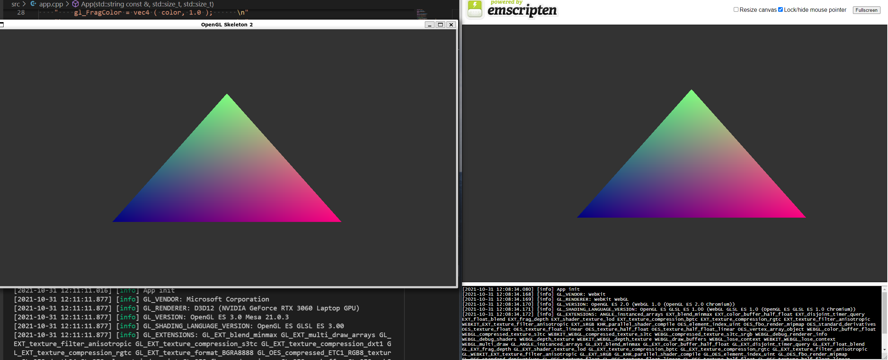
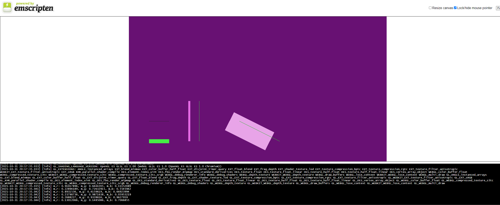

# 💀 OpenGL Skeleton 2

A no-fuss skeleton for creating OpenGL applications. Following on from my [2016 OpenGL Skeleton](https://github.com/zach2good/opengl-skeleton).

# Screenshots



## Build

### Windows

```ps
mkdir build
cd build
cmake ..
cmake --build .
.\Debug\opengl-skeleton-2.exe
```

### Browser (via Emscripten on Windows)

```ps
choco install ninja make
mkdir build
cd build
emcmake cmake -G Ninja ..
cmake --build .
emrun .\opengl-skeleton-2.html
```
### Ubuntu 20.04 (via WSL2 on Windows 11)

```bash
sudo apt-get install mesa-common-dev libgles2-mesa-dev
mkdir build
cd build
cmake ..
make
./opengl-skeleton-2
```

### Code dependencies

[CPM.cmake](https://github.com/cpm-cmake/CPM.cmake/tree/v0.34.0) will handle code dependencies at CMake configure time.

## License

[MIT License](LICENSE)
